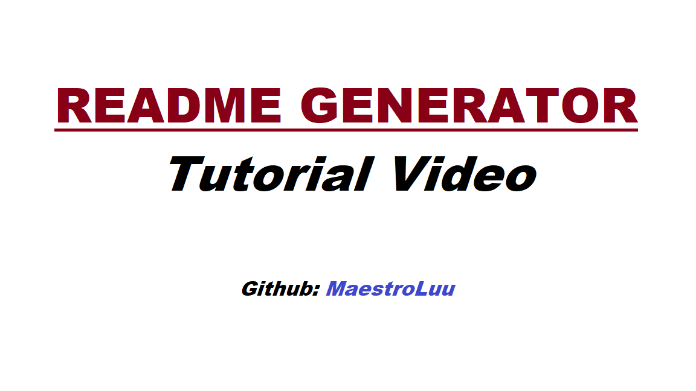

# README-Generator

## Description

This application allows users to create README.md files with inputted text from the user's responses. After completing the prompted questions within the application, a README.md will populate in the directory. 

## [Try it yourself!](https://github.com/MaestroLuu/README-Generator.git)

## Table of Contents
- [Installation](#installation)
- [Usage](#usage)
- [Technology](#technology)
- [Credits](#credits)
- [License](#license)
- [Questions](#questions)

## Installation

In order for the application to function properly, users must install inquirer. Users can install this package by going into their terminal and typing in "npm i inquirer".

## Usage

To use this application, users need to type into their terminal "node index.js". Once activated, the terminal will prompt questions for the user to respond. If the user cannot provide an answer, they can press enter and a default value will be implemented. After submitting all their answers, the application will generate a 'demo.md' populated with their responses.

## Technology

- JavaScript  
- NodeJS  
- NPM Inquirer

## Credits

No additional collaborators were involved with the development of this project. 
I utilized 'npm inquirer' for this project. Their link to this package can be found here: https://www.npmjs.com/package/inquirer  
No tutorials were used during this time. 

## Questions

If you have any additional questions regarding this application, please contact me via the channels provided below: 
Github: https://github.com/MaestroLuu 
Email: DLuu.audeo@gmail.com